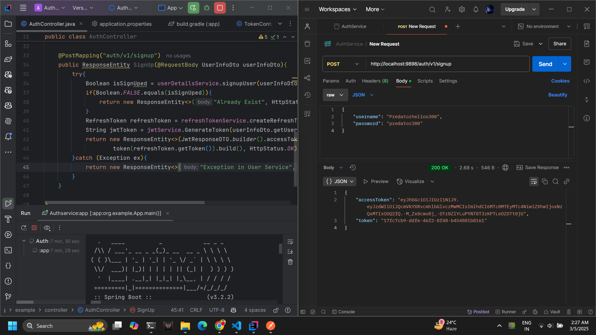
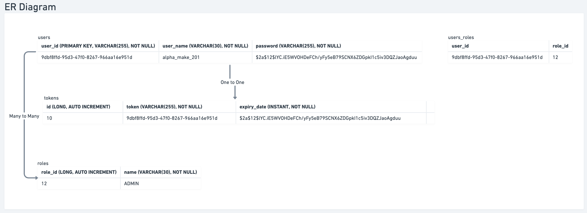

# Auth Service

## 🎯 Problem Statement
The Auth Service is responsible for authentication and authorization of incoming requests from the Templatisation service and API Gateway.

---

## ✨ Functional Requirements

- Users should be able to sign up and log in.
- Users should not be required to log in every time they open the app.
- Store encrypted passwords in the database.
- Allocate access tokens and refresh tokens.
- Tokens should be transmitted over HTTPS requests.
- Events published to userService should be recoverable and fault-tolerant.

---

## ✨ Non-Functional Requirements

- Authentication should be quick to prevent delays in app launch.
- Database should be optimized to avoid complex and long-running queries (LRQs).

---

## 🚀 Low-Level Design (LLD)

### UML Sequence Diagram
[View UML Diagram](https://whimsical.com/auth-service-design-Fm9uuXstaCTZK9szusHQqH)

### Components Overview

- **SecurityConfig:**
    - Configures security filters and defines beans like `AuthenticationProvider`.
    - Specifies endpoints to bypass security filters such as `/auth/v1/refreshToken`, `/auth/v1/signup`, `/auth/v1/login`.

- **JWTFilter:**
    - Intercepts requests and validates JWT tokens, excluding endpoints defined in `SecurityConfig`.

- **AuthController:**
    - Defines API endpoints such as `/auth/v1/signup`, `/auth/v1/login`, and `/ping`.

- **JwtService:**
    - Responsible for generating and validating JWT tokens.
    - Extracts claims like username and expiration time.

- **RefreshTokenService:**
    - Manages the creation and validation of refresh tokens.

- **UserDetailsServiceImpl:**
    - Handles user sign-up and fetching user details.
    - Extends `UserDetailsService` from `org.springframework.security.core.userdetails`.

- **AuthenticationManager:**
    - From Spring Security, manages authentication based on username and password.

---

## 🚀 Database ER Diagram

[View ER Diagram](https://whimsical.com/auth-service-design-Fm9uuXstaCTZK9szusHQqH)

---

## 🔒 Security Considerations

- **Password Hashing:** Use strong algorithms like bcrypt or Argon2.
- **Token Expiry:** Define expiration times for both access and refresh tokens.
- **Refresh Token Rotation:** Implement token rotation to invalidate old tokens upon reuse.
- **Rate Limiting:** Apply rate limiting on authentication endpoints to prevent brute-force attacks.
- **HTTPS Enforcement:** Use HSTS headers and enforce HTTPS for all endpoints.

---

## ⚙️ Scalability & Reliability

- **Distributed Token Storage:** Utilize Redis or a similar distributed cache for storing refresh tokens with expiration.
- **Event Retry Mechanism:** Implement retries with exponential backoff for events sent to userService.

---

## 🛠️ API Design

- **Error Handling:** Establish a standardized error response format.
- **Health Check Endpoint:** Implement a `/auth/v1/health` endpoint for monitoring service health.

---

## ✅ Testing Strategy

- **Unit and Integration Tests:** Cover critical flows like token generation, validation, and user sign-up.
- **Penetration Testing:** Conduct security tests focusing on token management and authentication mechanisms.

---

## 📈 Observability

- Implement logging and monitoring for authentication processes.
- Use tracing to track request flows and diagnose issues quickly.

---

## 📚 References
- [Auth Service Design Video](https://www.youtube.com/watch?v=OTau0K7JQKQ&list=PL7CBVLpg0zqeJTCCuU99RW1TMn8_Ii15n&index=14)
